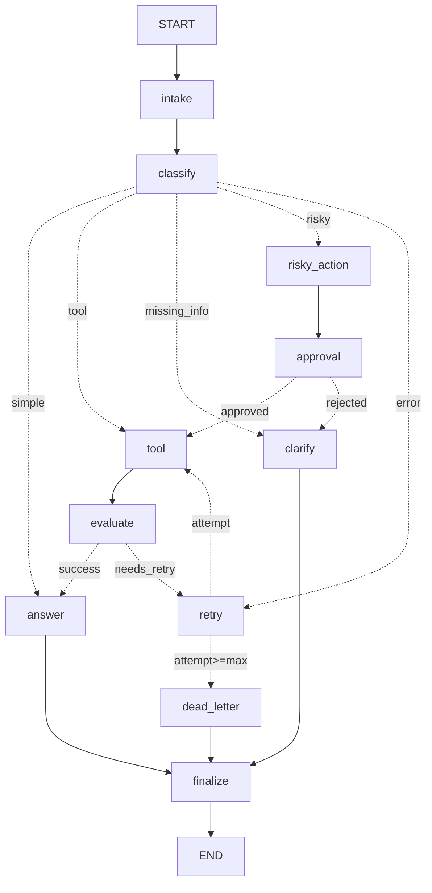

# Day 08 Lab Report — LangGraph Agentic Orchestration

## 0. Student

| Field | Value |
|---|---|
| Name | Vũ Hữu An |
| Id | 2A202601078 |
| Date | 2026-08-25 |
| Repo | Day23-2A202601078-VuHuuAn |

## 1. Metrics summary

| Metric | Value |
|---|---:|
| Total scenarios | 7 |
| Success rate | 100% |
| Avg nodes visited | 6.4 |
| Total retries | 3 |
| Total interrupts (approvals) | 2 |
| Resume success | False |

## 2. Per-scenario results

| Scenario | Expected | Actual | Success | Retries | Interrupts | Approval req/obs |
|---|---|---|:---:|---:|---:|:---:|
| S01_simple | simple | simple | ✅ | 0 | 0 | False/False |
| S02_tool | tool | tool | ✅ | 0 | 0 | False/False |
| S03_missing | missing_info | missing_info | ✅ | 0 | 0 | False/False |
| S04_risky | risky | risky | ✅ | 0 | 1 | True/True |
| S05_error | error | error | ✅ | 2 | 0 | False/False |
| S06_delete | risky | risky | ✅ | 0 | 1 | True/True |
| S07_dead_letter | error | error | ✅ | 1 | 0 | False/False |

## 3. Architecture

A single `StateGraph(AgentState)` with 11 nodes. `intake → classify` are fixed; `classify` branches via `route_after_classify` into five paths (simple, tool, missing_info, risky, error). The `tool → evaluate → [retry ↔ tool]` cycle forms a **bounded retry loop** (`route_after_retry` checks `attempt < max_attempts`, else escalates to `dead_letter`). Risky requests pass through `risky_action → approval → route_after_approval`. **Every path terminates at `finalize → END`.**

**State schema — reducers:**

| Field(s) | Reducer | Why |
|---|---|---|
| messages, tool_results, errors, events | append (`add`) | audit trail; never lose history |
| route, risk_level, attempt, evaluation_result, approval, proposed_action, pending_question | overwrite | only the latest value matters for the current decision |

## 4. Failure analysis

1. **Transient tool failure / unbounded retry.** `tool_node` simulates errors on the `error` route; `evaluate_node` flags `needs_retry`; `route_after_retry` bounds the loop by `max_attempts`. Without that bound the graph would loop forever — the dead-letter node is the third safety layer.

2. **Risky action executed without approval.** Refund/delete/email requests are routed to `risky_action → approval` *before* any tool executes. Only an `approved` decision reaches `tool`; a rejection is diverted to `clarify`, so a side-effecting action can never run un-reviewed.

## 5. Graph diagram

(Full auto-generated diagram: `outputs/graph_diagram.mmd`.)

## 6. Persistence / recovery

The graph compiles with a checkpointer and each scenario runs under its own `thread_id` (`thread-<scenario_id>`), so state is snapshotted per super-step. The SQLite checkpointer persists those snapshots to disk, enabling `get_state_history()` replay and crash-resume across process restarts.

**Evidence** (`outputs/persistence_evidence.txt`, from `cli persist-demo`): a *fresh* graph instance built over the same SQLite DB reads back the completed state (final answer present) and its full 6-checkpoint history — proving the state survived the original process.

## 7. Extensions completed

All Phase-5 extension tracks are implemented and verified (evidence in `outputs/`):

| Extension | Where | Evidence / command |
|---|---|---|
| Parallel fan-out / fan-in (`Send()`) | `parallel.py` | `cli parallel-demo` → `outputs/parallel_evidence.txt` |
| Real HITL (`interrupt()` + `Command(resume)`) | `approval_node`, `extensions.py` | `cli hitl-demo --approve/--reject` → `outputs/hitl_evidence.txt` |
| Time-travel replay (`get_state_history`) | `extensions.py` | `cli timetravel-demo` → `outputs/timetravel_evidence.txt` |
| Crash recovery across processes | `crash_child.py`, `cli.crash-demo` | `cli crash-demo` → `outputs/crash_evidence.txt` |
| SQLite persistence (WAL) | `persistence.py` | `cli persist-demo` → `outputs/persistence_evidence.txt` |
| Graph diagram (Mermaid) | `cli.diagram` | `cli diagram` → `outputs/graph_diagram.mmd` |
| LLM-as-judge (evaluate) | `nodes.evaluate_node` | enable with `LAB_LLM_JUDGE=true` |
| **Ant Design HITL console** (FastAPI + React 18 + antd 5) | `api.py`, `ui/` | `cli serve` → screenshots in `docs/screenshots/` |

The Ant Design console is the human interface for the real-HITL track: submitting a risky ticket pauses the graph at `interrupt()`; the reviewer approves/rejects and the graph resumes via `Command(resume=...)`. See `docs/screenshots/ui-approval.png` (pending approval) and `docs/screenshots/ui-completed.png` (resumed & completed).

## 8. Improvement plan

Real HITL, the Ant Design console, persistence, time-travel, crash recovery and parallel fan-out are already done. With one more day I would: (a) replace the checkpointer with Postgres for multi-worker durability and add authentication to the approval console, (b) add exponential backoff + jitter to the retry loop and surface per-node latency in `metrics.json`, (c) turn on the LLM-as-judge (`LAB_LLM_JUDGE=true`) with a confidence threshold and a self-repair retry prompt, and (d) stream node-by-node progress to the UI over WebSockets instead of polling.
